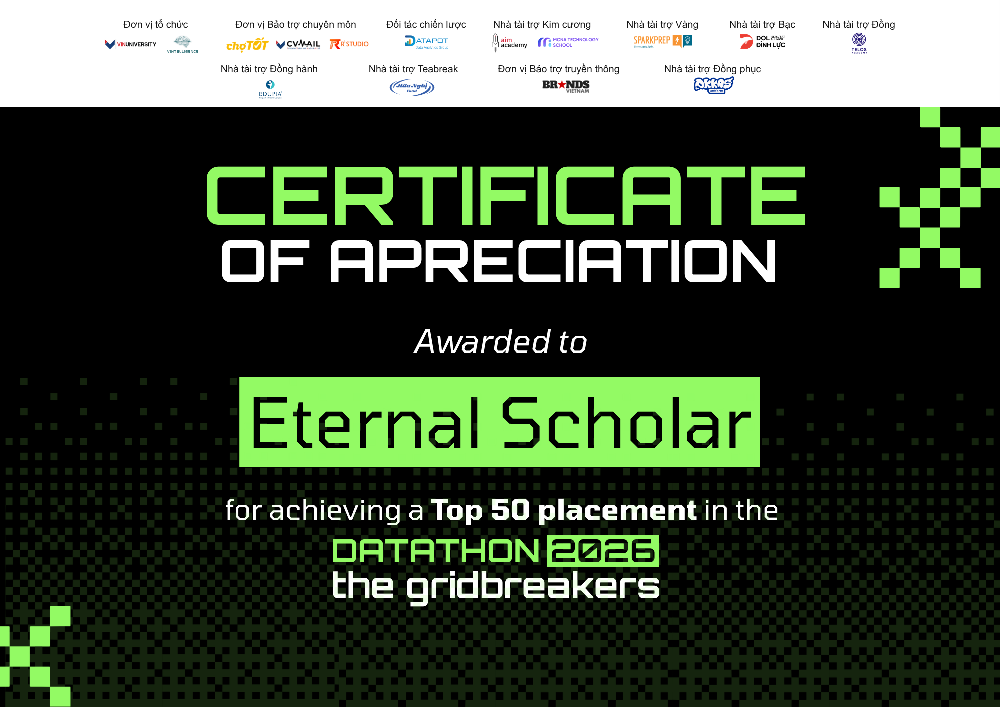

# Gridbreaker Datathon 2026 - Task 3 Forecasting


Repo này chứa source code cho **Task 3** của cuộc thi Datathon 2026. Mục tiêu của task là dự báo hai chỉ tiêu theo ngày:

- `Revenue`
- `COGS`

Pipeline chính của repo gồm 2 bước bắt buộc:

1. Chạy `run_tuning.py` để tìm bộ tham số tốt cho LightGBM và lưu ra `best_lgb_params.json`.
2. Chạy `run_pipeline.py` để train mô hình cuối cùng và tạo file `submission.csv`.

Ngoài ra, repo có file `make_task3_figures.py` dùng để tạo các hình báo cáo sau khi đã có `submission.csv`.

---

## 1. Cấu trúc thư mục

```text
DataThon-main/
│
├── data/
│   └── raw/
│       └── sales.csv                 # Dữ liệu gốc dùng cho Task 3, tự tải từ Kaggle
│
├── src/
│   ├── data_prep.py                  # Tạo calendar features, holiday features, promo features
│   ├── train_model.py                # Train LightGBM, Q-specialists, Ridge
│   ├── cv_validation.py              # Time-series validation folds
│   ├── tune_hyperparams.py           # Optuna tuning cho LightGBM
│   ├── tune_model.py                 # File tuning phụ/legacy
│   └── clean_data.py                 # Script làm sạch dữ liệu phục vụ phân tích BI/EDA
│
├── notebooks/
│   ├── 01_EDA_Visualizations.ipynb
│   ├── 02_Feature_Engineering.ipynb
│   ├── 03_Model_SHAP_Analysis.ipynb
│   └── shap_analysis.ipynb
│
├── reports/
│   └── figures/                      # Folder lưu figure/report figure
│
├── submissions/
│   └── submission.csv                # Có thể dùng để lưu bản submission cuối
│
├── run_tuning.py                     # Bước 1: tuning LightGBM bằng Optuna
├── run_pipeline.py                   # Bước 2: train final model và tạo submission.csv
├── make_task3_figures.py             # Tạo 16 figure cho báo cáo Task 3
├── best_lgb_params.json              # Best params sau khi tuning
├── requirements.txt                  # Danh sách thư viện cần cài
└── README.md
```

---

## 2. Yêu cầu dữ liệu

Repo này **không push dữ liệu raw lên GitHub** vì thư mục `data/` đã được ignore trong `.gitignore`.

Sau khi clone repo, cần tự tạo thư mục và bỏ dữ liệu vào đúng vị trí sau:

```text
data/raw/sales.csv
```

File `sales.csv` tối thiểu cần có các cột sau:

```text
Date, Revenue, COGS
```

Trong đó:

- `Date`: ngày bán hàng, định dạng đọc được bởi pandas, ví dụ `2022-12-31`.
- `Revenue`: doanh thu theo ngày.
- `COGS`: giá vốn theo ngày.

Nếu thiếu file này, cả `run_tuning.py`, `run_pipeline.py` và `make_task3_figures.py` đều sẽ lỗi.

---

## 3. Clone repo

```bash
git clone <LINK_REPO_GITHUB>
cd DataThon-main
```

Thay `<LINK_REPO_GITHUB>` bằng link repo thật.

---

## 4. Tạo môi trường ảo

### Windows PowerShell

```powershell
python -m venv .venv
.\.venv\Scripts\Activate.ps1
```

Nếu PowerShell báo lỗi không cho activate, chạy lệnh này rồi activate lại:

```powershell
Set-ExecutionPolicy -Scope Process -ExecutionPolicy Bypass
.\.venv\Scripts\Activate.ps1
```

### macOS/Linux

```bash
python3 -m venv .venv
source .venv/bin/activate
```

Khuyến nghị dùng Python `3.10` đến `3.12`.

---

## 5. Cài thư viện

Sau khi đã activate môi trường ảo, chạy:

```bash
pip install --upgrade pip
pip install -r requirements.txt
```

Kiểm tra nhanh các thư viện chính:

```bash
python -c "import pandas, numpy, sklearn, lightgbm, optuna; print('OK')"
```

---

## 6. Chuẩn bị dữ liệu

Tạo folder dữ liệu:

### Windows PowerShell

```powershell
mkdir data
mkdir data\raw
```

### macOS/Linux

```bash
mkdir -p data/raw
```

Sau đó copy file `sales.csv` từ dữ liệu cuộc thi vào:

```text
data/raw/sales.csv
```

---

## 7. Cách chạy model Task 3

### Bước 1: Chạy tuning trước

```bash
python run_tuning.py
```

File này sẽ:

- đọc `data/raw/sales.csv`,
- tạo feature bằng `src/data_prep.py`,
- tune LightGBM bằng Optuna,
- lưu bộ tham số tốt nhất vào:

```text
best_lgb_params.json
```

Mặc định file đang chạy `30` trials. Nếu muốn đổi số trials, hiện tại cần sửa trực tiếp dòng này trong `run_tuning.py`:

```python
best_params = tune_lgb(X, y_rev, w, dates, n_trials=30)
```

Ví dụ muốn chạy nhanh để test trước thì đổi `30` thành `5`.

---

### Bước 2: Chạy pipeline sau

```bash
python run_pipeline.py
```

File này sẽ:

- đọc `best_lgb_params.json` nếu có,
- đọc `data/raw/sales.csv`,
- tạo calendar features cho train và test,
- train LightGBM base model,
- train Q-specialists cho 4 quý,
- train Ridge Regression,
- blend model,
- calibration kết quả cuối,
- xuất file submission tại:

```text
submission.csv
```

Đây là file dùng để upload lên Kaggle.

---

## 8. Flow chạy chuẩn từ đầu đến cuối

Sau khi clone repo, tạo venv, cài thư viện và đặt `sales.csv` đúng chỗ, chạy theo thứ tự:

```bash
python run_tuning.py
python run_pipeline.py
```

Sau khi chạy xong, kiểm tra file:

```text
submission.csv
```

File submission cần có dạng:

```text
Date,Revenue,COGS
2023-01-01,...,...
2023-01-02,...,...
...
```

---

## 9. Tạo figure cho báo cáo Task 3

Sau khi đã có `submission.csv`, có thể tạo 16 figure bằng:

```bash
python make_task3_figures.py --raw-dir data/raw --submission submission.csv --best-params best_lgb_params.json --out-dir reports
```

Mặc định figure sẽ được lưu trong folder:

```text
reports/
```

Nếu không muốn đụng folder `reports` cũ, đổi sang folder khác, ví dụ `reports1`:

```bash
python make_task3_figures.py --raw-dir data/raw --submission submission.csv --best-params best_lgb_params.json --out-dir reports1
```

Nếu muốn xóa folder output cũ trước khi tạo lại:

```bash
python make_task3_figures.py --raw-dir data/raw --submission submission.csv --best-params best_lgb_params.json --out-dir reports1 --clean
```

Nếu muốn tạo figure nhanh hơn và bỏ qua các hình cần train model lại:

```bash
python make_task3_figures.py --raw-dir data/raw --submission submission.csv --out-dir reports1 --skip-model-figures
```

---

## 10. Các file output quan trọng

| File/Folder | Ý nghĩa |
|---|---|
| `best_lgb_params.json` | Bộ tham số LightGBM tốt nhất sau tuning |
| `submission.csv` | File kết quả để nộp Kaggle |
| `reports/` hoặc `reports1/` | Folder chứa figure báo cáo |
| `reports/figure_manifest.csv` | Danh sách các figure đã tạo, nếu chạy script figure |
| `reports/figure_captions.md` | Gợi ý caption cho từng figure, nếu chạy script figure |

---

## 11. Mô tả ngắn về mô hình

Pipeline hiện tại dùng hướng tiếp cận calendar-only forecasting:

1. **Feature Engineering**
   - Tạo đặc trưng ngày, tháng, quý, thứ trong tuần.
   - Tạo seasonal Fourier features theo năm, tuần, tháng.
   - Tạo biến ngày lễ Việt Nam.
   - Tạo biến liên quan đến Tết.
   - Tạo biến khuyến mãi/promotion windows.

2. **LightGBM Base Model**
   - Train riêng cho `Revenue` và `COGS` trên log target bằng `np.log1p`.
   - Sử dụng sample weight, ưu tiên giai đoạn 2014-2018.

3. **Quarter Specialists**
   - Train thêm mô hình chuyên biệt cho từng quý.
   - Mỗi model tăng trọng số dữ liệu thuộc quý tương ứng.

4. **Ridge Regression**
   - Dùng làm model tuyến tính phụ để blend với LightGBM.

5. **Ensemble + Calibration**
   - Blend Ridge với LightGBM.
   - Nhân hệ số calibration cuối cùng để tạo dự báo submission.

---

## 12. Một số lỗi thường gặp

### Lỗi thiếu file `sales.csv`

Thông báo thường gặp:

```text
FileNotFoundError: data/raw/sales.csv
```

Cách sửa: kiểm tra lại file có nằm đúng đường dẫn này không:

```text
data/raw/sales.csv
```

---

### Lỗi chưa activate venv

Nếu chạy `python` nhưng không nhận thư viện đã cài, hãy activate lại môi trường:

```powershell
.\.venv\Scripts\Activate.ps1
```

hoặc trên macOS/Linux:

```bash
source .venv/bin/activate
```

---

### Lỗi thiếu `optuna`

Nếu gặp:

```text
ModuleNotFoundError: No module named 'optuna'
```

Chạy lại:

```bash
pip install -r requirements.txt
```

---

### Lỗi LightGBM trên Windows

Thử cập nhật pip và cài lại:

```bash
pip install --upgrade pip setuptools wheel
pip install lightgbm
```

Nếu vẫn lỗi, nên dùng Python bản 64-bit và phiên bản Python ổn định như `3.10`, `3.11` hoặc `3.12`.

---

## 13. Ghi chú cho người maintain repo

- Không nên push dữ liệu raw lên GitHub.
- Nên giữ `data/` trong `.gitignore`.
- Nên commit `requirements.txt`, `README.md`, source code và notebook.
- Nếu muốn lưu nhiều bản submission, có thể copy file sau khi chạy pipeline:

```bash
cp submission.csv submissions/submission_v1.csv
```

Trên Windows PowerShell:

```powershell
copy submission.csv submissions\submission_v1.csv
```

---

## 14. Lệnh chạy nhanh

```bash
# 1. Tạo venv
python -m venv .venv

# 2. Activate venv - Windows
.\.venv\Scripts\Activate.ps1

# 3. Cài thư viện
pip install --upgrade pip
pip install -r requirements.txt

# 4. Đặt file sales.csv vào data/raw/sales.csv

# 5. Tuning
python run_tuning.py

# 6. Train final pipeline và tạo submission
python run_pipeline.py

# 7. Tạo figure báo cáo nếu cần
python make_task3_figures.py --raw-dir data/raw --submission submission.csv --best-params best_lgb_params.json --out-dir reports1
```
